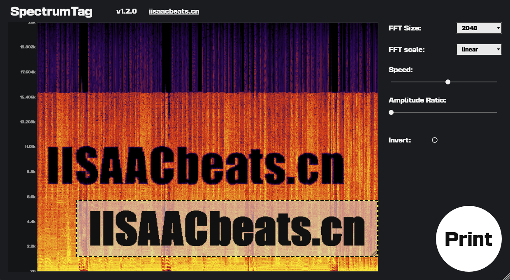

# SpectrumTag v1.3.0

**SpectrumTag** 把 **图片轮廓** 变成 **频域掩码**，再用 STFT / OLA 把它"印章"（Print）到音频的频谱上 —— 于是你的音频里会真的"长出"这张图的形状，在任意频谱分析软件里都能看到它。

> **先用哪个？**
> SpectrumTag 有两个形态：**独立程序（`SpectrumTag.exe` / `SpectrumTag.app`，推荐）** 和 **VST3 / AU 插件（补充）**。
> 日常使用请直接用独立程序：拖进音频 → 拖进图片 → 点 Print → 得到 WAV，全程离线、一次成型。
> 插件形态需要在宿主里实时播放、并用自动化曲线去控制 Print 的触发时机，只在"想在 DAW 工程内做实时/自动化处理"时才用。



---

## 1. 两种形态怎么选

| | **独立程序（Standalone）** | **VST3 / AU 插件** |
| --- | --- | --- |
| 典型用途 | 把一整段音频文件一次性处理完并导出 | 在 DAW 工程里做实时效果 / 自动化 |
| 输入 | 本地音频文件（WAV / MP3 / FLAC / AIFF / OGG） | 宿主轨道的实时音频流 |
| 频谱显示 | 整段音频的**静态完整时频图**，可缩放、可拖动 | 随播放**实时滚动**的瀑布图 |
| 触发方式 | 点一次 **Print**，后台离线合成 | 手动点按钮，或用 `Print Trigger` 自动化 / MIDI Learn |
| 输出 | 导出 `<原文件名>_tagged.wav` 到指定目录 | 走宿主播放 / bounce 输出 |
| 需要宿主 | 不需要 | 需要 |
| 推荐度 | **推荐（主用法）** | 补充用法 |

---

## 2. 独立程序：三步上手

1. **拖入音频**：把音频文件拖到窗口任意位置（或点击频谱空白区选择文件）。左侧会立刻画出整段音频的时频图。
2. **拖入图片**：把 `png / jpg / jpeg / bmp / gif` 图片拖进来。频谱上会出现一个可拖动、可缩放的**图片框**。
3. **点 Print**：右下角圆形按钮 → 选择输出目录 → 后台渲染 → 得到 `<原文件名>_tagged.wav`。

图片框**框住哪里，印章就盖在哪里**：横向 = 音频时间位置，纵向 = 频率位置（顶部高频、底部低频）。

---

## 3. 界面与操作

### 3.1 频谱区（左侧）

- 载入音频后立即计算并缓存整段时频图，不再滚动。
- **Speed** 滑杆 / 鼠标按住频谱**横向拖动**：缩放和平移时间轴，用来精确对齐图片框的位置。
- **FFT scale = mel** 时，左侧频率轴显示对数刻度并附带**钢琴键盘**（C1–C8 标注），方便把印章对准音高。
- 顶部标题栏右侧显示当前文件信息：文件名 / 时长 / 采样率 / 声道数。

### 3.2 图片框（右侧频谱上的黄框）

| 操作 | 说明 |
| --- | --- |
| 未选图时**单击**框内 | 弹出图片选择对话框 |
| **拖动**框体 | 移动位置（改变印章的时间 / 频率落点） |
| **拖动**右下角小方块 | 等比缩放（改变印章的大小） |

图片载入后会自动做预处理：缩放到最长边 2048 px → 按亮度（或 Alpha 通道，透明像素占比高时自动切到 Alpha 模式）**二值化**，框内显示的就是最终用于生成掩码的黑白图。

### 3.3 参数区（右侧）

| 参数 | 取值 | 说明 |
| --- | --- | --- |
| `FFT Size` | 1024 / 2048 / 4096（默认）/ 8192 | 时频分辨率。越大频率越细、时间越粗；印章细节也随之变化 |
| `FFT scale` | `linear` / `mel` | 频率轴映射方式。**mel 时图片框的纵向位置按对数频率解释**，适合对准音高 |
| `Speed` | 0.1 – 4.0（默认 1.0） | 时频图横向缩放。放大后图片框覆盖的**音频时长变短**（印章更短促），缩小则覆盖更长时间 |
| `Amplitude Ratio` | 0.0 – 1.5 | 印章强度。见下方说明 |
| `Invert` | 开 / 关 | 掩码反相（图形区域与背景区域互换处理） |

**Amplitude Ratio 怎么理解**（`gain = 1 → ratio` 映射到掩码亮暗）：

- `0.0`：图形轮廓区域被**完全抹掉**（在频谱上挖出一个"图形形状的洞"，最直观的效果）；
- `1.0`：无变化（等于没盖章）；
- `1.0 – 1.5`：图形轮廓区域被**提升**；
- `0.0 – 1.0` 之间：轮廓区域按比例**衰减**；
- 勾上 `Invert` 后，图形区域与背景区域的处理方向互换。

### 3.4 Print 按钮（右下角）

- 没有音频时点击 → 直接弹出音频选择器（不报错）。
- 没有图片时点击 → 提示先载入图片。
- 有音频有图片 → 弹出**输出目录**选择框 → 后台线程离线合成 → 完成后弹窗告知输出路径。
- 输出为 **WAV**，保持原音频的采样率、位深（16 / 24 / 32）与声道数；文件名 `<原名>_tagged.wav`，若已存在则自动追加 `_1`、`_2` …

---

## 4. VST3 / AU 插件形态（补充用法）

插件形态是**实时流式**的：把 SpectrumTag 挂到轨道上，播放时频谱才会滚动，印章也只在 Print 被触发的那段时间写入。

- **Print 触发有三种方式**：
  1. 直接点 UI 上的 Print 按钮；
  2. DAW **自动化曲线**写 `Print Trigger`（布尔参数，仅在 `false → true` 上升沿响应一次）；
  3. DAW **MIDI Learn** 绑定 `Print Trigger`，用 MIDI 控制器物理触发。
- **离线导出（bounce / freeze）同样有效**：宿主不创建插件界面时，由音频线程自行消费触发请求，导出音频里也会有印章。
- **工程持久化**：工程会记录当前图片路径与图片框位置，重新打开自动恢复；图片文件丢失时不阻塞，仅回退到"Choose picture"占位。
- 参数除 `Print Trigger` 外与独立程序一致（`FFT Size` / `FFT scale` / `Speed` / `Amplitude Ratio` / `Invert`）。

> 也就是说：如果你只是想"给一个音频文件盖章"，用独立程序；只有在需要实时听、或用自动化精确编排触发时机时，才用插件。

---

## 5. 安装

### 5.1 Windows

运行 `SpectrumTag_Setup_1.3.0_x64.exe`，安装时可选组件：

- **VST3 plug-in** → 默认装到 `%CommonProgramFiles%\VST3\iisaacbeats.cn\SpectrumTag.vst3`
- **standalone application** → 装到 `C:\Program Files\iisaacbeats.cn\SpectrumTag\SpectrumTag.exe`（开始菜单有快捷方式，可勾选创建桌面快捷方式）

> 若把 VST3 装到非默认目录，安装后会提示你需要在 DAW 中手动添加该目录并重新扫描插件。

### 5.2 macOS

打开 `.dmg`，运行其中的 `.pkg`，会安装：

- `SpectrumTag.vst3` → `/Library/Audio/Plug-Ins/VST3/`
- `SpectrumTag.component`（AU）→ `/Library/Audio/Plug-Ins/Components/`
- `SpectrumTag.app`（独立程序）→ `/Applications/`

---

## 6. 从源码构建

依赖：CMake 3.22+、支持 C++17 的编译器（MSVC 19.30+ / Clang 13+ / GCC 10+）。JUCE 通过 `FetchContent` 自动拉取，无需手动安装。

```bash
# 一次性构建插件 + 独立程序
cmake -S . -B cmake-build-release -DCMAKE_BUILD_TYPE=Release
cmake --build cmake-build-release --config Release --target SpectrumTag_All
```

产物：

- 独立程序：`cmake-build-release/SpectrumTagStandalone_artefacts/Release/SpectrumTag.exe`（macOS 为 `SpectrumTag.app`）
- VST3：`cmake-build-release/SpectrumTag_artefacts/Release/VST3/SpectrumTag.vst3`

打包：

- Windows：`build_installer.bat`（需 Inno Setup 6），输出到 `dist\`
- macOS：`build_macos_installer.sh`，输出 `.pkg` 与 `.dmg`

---

## 7. 常见问题

**Q：图片盖上去没反应 / 效果很弱？**
检查 `Amplitude Ratio` 是否为 0 附近（0 = 图形被抹除，1 = 无变化，>1 = 提升），以及是否误勾了 `Invert`。

**Q：印章出现在了错误的时间点？**
图片框的横向位置决定时间。用 `Speed` 放大时间轴后再精确定位，会更准。

**Q：切换 FFT scale 后频谱没变？**
v1.3.0 起切换 `linear / mel` 会立即重新计算时频图。若仍无变化，请确认使用的是最新构建。

**Q：支持哪些文件？**
音频：`.wav .mp3 .flac .aif .aiff .ogg`；图片：`.png .jpg .jpeg .bmp .gif`；输出固定为 `.wav`。

---

## 8. 版本历史

- **v1.3.0**：新增启动后自动检查更新（延迟 5 秒、异步、失败静默，插件与独立程序均生效）；修复切换 `FFT scale` 后频谱未实时重算的问题；安装包同时包含 **独立程序** 与 VST3 插件。
- **v1.2.3**：离线渲染 / 导出自动化支持（实时路径由 Editor timer 消费触发，离线路径由音频线程消费）；加载抑制窗口改用 sample-clock；`imgBoxWidthPx` 持久化，离线与预览结果精确对齐。
- **v1.2.0**：首个正式发布版本。完整 STFT / OLA / WOLA 归一化、图片打印起始完整性、工程持久化（图片路径与图片框位置）、Print 自动化与 MIDI Learn（五层防误触保护）、Windows / macOS 一键打包。

---

## 9. 许可证（License）

### 9.1 许可协议

本项目采用 **GNU Affero General Public License v3.0（AGPL-3.0）**，完整条款见 [LICENSE](LICENSE)。

| 条款 | 说明 |
| --- | --- |
| **源码强制公开** | 任何分发（含二进制 / 编译产物）必须随附完整源代码，或提供可获取源码的书面承诺 |
| **衍生作品必须继承** | 任何基于本项目的修改、衍生或二次开发，无论以源码还是目标码发布，**必须同样以 AGPL-3.0 开源** |
| **网络交互触发 Copyleft** | 即使通过远程网络服务（SaaS / 云端）提供本软件功能，也**必须向所有使用者提供完整源代码**（AGPL 第 13 条） |
| **禁止附加限制** | 不得对 AGPL 授予的权利施加额外收费、授权费或其它限制 |
| **无担保** | 不提供任何明示或默示担保，使用者自行承担风险 |

> 简要理解：可以自由使用、修改、学习本项目代码，但**任何形式的再分发（销售、打包进商业产品、云服务提供），都必须将你的全部修改以 AGPL-3.0 完整开源**。这是法律强制要求。

### 9.2 反商业化滥用声明

源代码公开旨在促进音频 DSP 技术社区的学习与交流。**我们明确保留追究以下行为的法律权利**：

- 未经授权将本项目编译产物打包为商业软件并收取授权费用；
- 在未遵守 AGPL-3.0 完整义务（包括公开衍生源代码）的情况下投入商业分发渠道（应用商店、付费插件平台等）；
- 去除、隐藏或篡改版权与许可证声明以掩盖来源。

如需商业授权（不在 AGPL-3.0 下公开你的修改），请联系作者协商 **双许可证（Dual Licensing）**。

### 9.3 版权

© iisaacbeats.cn — 保留所有权利。
